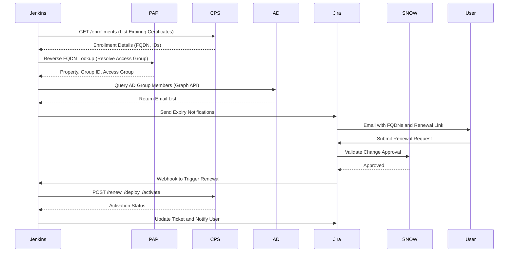

# Akamai Certificate Renewal Automation – Design Document

## Overview

This document describes the Akamai Certificate Renewal Automation system, which streamlines the end-to-end lifecycle of certificate renewals across Akamai CPS, Jira, ServiceNow, and Active Directory integrations.

The system:
- Automates certificate discovery, renewal, deployment, and activation.
- Eliminates manual input of access groups by performing reverse FQDN lookups.
- Uses AD group mappings for email notifications and approval routing.
- Integrates Jira Front Door workflows with ServiceNow change control and Jenkins CI/CD pipelines.

## System Architecture Summary

| Layer | Description |
|-------|--------------|
| Jenkins Automation | Runs scheduled discovery and renewal jobs. Orchestrates CPS API calls, access group lookups, AD queries, and notifications. |
| Akamai APIs (CPS / PAPI) | Provide certificate enrollment data, renewal capabilities, and reverse FQDN to access group resolution. |
| Active Directory & Notification Layer | Maps access groups to AD groups, validates membership, and retrieves user email addresses. |
| Jira Front Door Workflow | Handles certificate renewal requests, change ticket validation, and webhook triggers for automation. |
| ServiceNow Change Control | Ensures compliance and governance for renewals through linked change approvals. |

## Detailed Workflow Explanation

### 1. Discovery Phase
- Jenkins scheduled job runs `akamai_cert_manager.py` discovery mode.  
- Retrieves expiring enrollments (≤28 days) via `GET /cps/v2/enrollments`.
- Uses reverse FQDN lookup (PAPI) to resolve FQDN to property to group ID to access group name.
- Maps access group to corresponding AD group and fetches group members.

### 2. Notification Phase
- Jenkins compiles discovered expiring certificates.  
- Renders and sends expiry notifications to all AD group members.  
- Updates Confluence expiry dashboards.

### 3. Renewal Phase
- User submits Jira Front Door renewal request.  
- Jira validates linked ServiceNow change ticket for approval and window.  
- Once approved, Jira triggers Jenkins renewal job via webhook.  
- Jenkins calls CPS API to renew, deploy, and activate certificate in staging and production.

### 4. Completion Phase
- Jenkins updates Jira ticket with logs, statuses, and activation results.  
- Jira notifies the requestor of successful completion.  
- ServiceNow change ticket automatically transitions to “Closed”.

## Architecture Diagrams

### 1. Horizontal Swimlane (Flowchart LR)

```mermaid
flowchart LR
subgraph JENKINS [Jenkins Automation]
  J1([Scheduled Discovery Job]) --> J2[Run Akamai Cert Manager - Discovery Module]
  J2 --> J3[Identify Expiring Certificates (less than or equal to 28 days)]
  J3 --> J4[Reverse FQDN Lookup via PAPI - Auto Resolve Access Group]
  J4 --> J5[Access Group to AD Group Mapping]
  J5 --> J6{AD Group Exists?}
  J6 -- No --> J6a[Log Warning and Skip Notification]
  J6 -- Yes --> J7[Fetch AD Member Emails]
  J7 --> J8[Render and Send Expiry Notifications]
  J8 --> J9[Update Confluence Expiry Dashboard]
  J10([Jira Webhook Trigger]) --> J11[Run Renewal Job - Renew Enrollment]
  J11 --> J12[Call CPS API - Renew / Deploy / Activate]
  J12 --> J13[Post Renewal Results to Jira]
end

subgraph AKAMAI [Akamai APIs - CPS / PAPI]
  A1[GET /cps/v2/enrollments - List Enrollments] --> A2[Identify Expiring Enrollments]
  A2 --> A3[Reverse FQDN Lookup - Match Property to Access Group]
  A3 --> A4[POST /cps/v2/enrollments/{id}/renew]
  A4 --> A5[Poll CPS for CSR_READY and Submit CSR to CA]
  A5 --> A6[POST /cps/v2/deployments - Deploy Certificate]
  A6 --> A7[POST /cps/v2/activations - Activate Staging and Prod]
end

subgraph AD [Active Directory and Notification Layer]
  D1[Access Group to AD Group Mapping] --> D2[Fetch Group Membership via Graph API]
  D2 --> D3[Validate Group Exists and Has Members]
  D3 --> D4[Return Recipient Emails to Jenkins]
  D4 --> D5[Render and Send Notifications]
end

subgraph JIRA [Jira Front Door and Workflow]
  B1([User Receives Expiry Email]) --> B2[Submit Renewal Request via Jira Form - Access Group Auto Resolved from FQDN]
  B2 --> B3[Jira Creates Change Ticket]
  B3 --> B4[Validate Linked ServiceNow Change]
  B4 --> B5{Change Approved?}
  B5 -- No --> B6[Set Status: Awaiting Approval]
  B5 -- Yes --> B7[Trigger Jenkins Renewal Job via Webhook]
  B7 --> B8[Update Ticket with Renewal Status and Logs]
  B8 --> B9[Email Requestor on Completion]
end

subgraph SNOW [ServiceNow Change Management]
  S1[Create Linked Change Request] --> S2[Approval Workflow]
  S2 --> S3[Change Approved and Notify Jira]
  S3 --> S4[Change Complete and Closed]
end

J3 -- Fetch expiring FQDNs --> A1
J4 -- Uses --> A3
A3 -- Returns --> J4
J4 -- Triggers --> D1
D4 -- Returns --> J7
J8 -- Sends --> B1
B7 -- Triggers --> J10
J11 -- Calls --> A4
A7 -- Returns Status --> J13
B4 -- Syncs --> S2
J13 -- Updates --> B8
B8 -- Closes --> S4

style JENKINS fill:#003366,stroke:#ffffff,color:#ffffff
style AKAMAI fill:#004c99,stroke:#ffffff,color:#ffffff
style AD fill:#006699,stroke:#ffffff,color:#ffffff
style JIRA fill:#007acc,stroke:#ffffff,color:#ffffff
style SNOW fill:#0099cc,stroke:#ffffff,color:#ffffff
```

### 2. Vertical Swimlane (Flowchart TB)

```mermaid
flowchart TB
subgraph JENKINS [Jenkins Automation]
  J1([Scheduled Discovery Job])
  J2[Run Cert Manager - Discovery]
  J3[Identify Expiring Certificates]
  J4[Reverse FQDN Lookup via PAPI - Auto Access Group]
  J5[Access Group to AD Group Mapping]
  J6{AD Group Exists?}
  J7[Fetch AD Member Emails]
  J8[Render and Send Notifications]
  J9[Update Confluence Dashboard]
end

subgraph AKAMAI [Akamai APIs - CPS / PAPI]
  A1[GET /cps/v2/enrollments]
  A2[Identify Expiring Enrollments]
  A3[Reverse FQDN Lookup - Property to Group]
  A4[POST /enrollments/{id}/renew]
  A5[Deploy and Activate Certificates]
end

subgraph AD [Active Directory Layer]
  D1[Access Group to AD Group]
  D2[Validate and Fetch Members]
  D3[Return Email Recipients]
end

subgraph JIRA [Jira Workflow]
  B1[User Submits Renewal Form]
  B2[Change Ticket Created]
  B3[ServiceNow Change Validated]
  B4{Approved?}
  B5[Trigger Jenkins Renewal]
  B6[Update Ticket and Notify User]
end

subgraph SNOW [ServiceNow]
  S1[Change Request]
  S2[Approval Workflow]
  S3[Notify Jira on Approval]
end

J1 --> J2 --> J3 --> J4 --> J5 --> J6
J6 -->|Yes| J7 --> J8 --> J9
J3 --> A1 --> A2 --> A3 --> A4 --> A5
J4 --> D1 --> D2 --> D3 --> J7
B1 --> B2 --> B3 --> B4
B4 -->|Yes| B5 --> J11
B5 --> B6
B3 --> S2 --> S3 --> B4

style JENKINS fill:#003366,color:#ffffff
style AKAMAI fill:#004c99,color:#ffffff
style AD fill:#006699,color:#ffffff
style JIRA fill:#007acc,color:#ffffff
style SNOW fill:#0099cc,color:#ffffff
```

### 3. Simplified End-to-End Flow



## Notes for Documentation

- For Confluence:  
  Paste the Mermaid blocks directly — Confluence renders Mermaid automatically in fenced code blocks (```mermaid).

- For GitHub:  
  GitHub Markdown supports Mermaid natively since 2023.  
  Just commit the .md file as-is; the diagrams render automatically in the repo.

## File Naming Recommendation

```
akamai_cert_renewal_design_fixed.md
```
