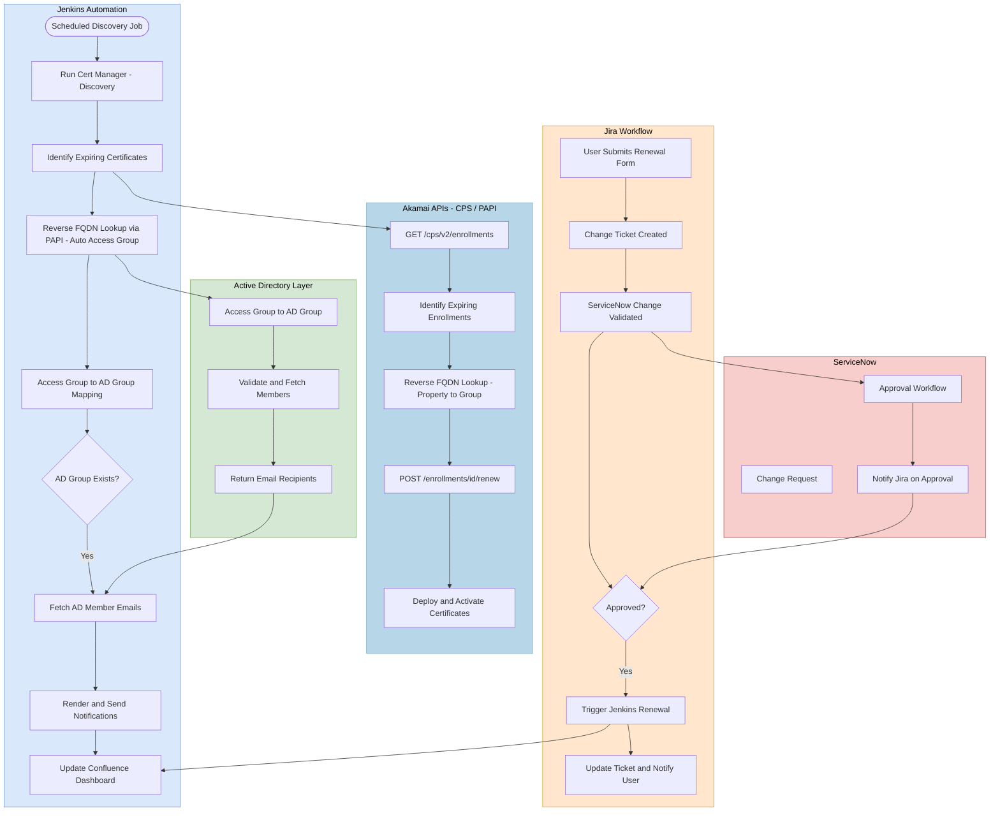

# Akamai Certificate Renewal Automation – Design Document (Light Theme)

## Overview

This document outlines the Akamai Certificate Renewal Automation architecture and workflow, including Jenkins, Akamai APIs (CPS/PAPI), Active Directory, Jira, and ServiceNow integrations.

---

## 1. Horizontal Swimlane (Flowchart LR)

```mermaid
flowchart LR
subgraph JENKINS [Jenkins Automation]
  J1([Scheduled Discovery Job]) --> J2[Run Akamai Cert Manager - Discovery Module]
  J2 --> J3[Identify Expiring Certificates - less than or equal to 28 days]
  J3 --> J4[Reverse FQDN Lookup via PAPI - Auto Resolve Access Group]
  J4 --> J5[Access Group to AD Group Mapping]
  J5 --> J6{AD Group Exists?}
  J6 -- No --> J6a[Log Warning and Skip Notification]
  J6 -- Yes --> J7[Fetch AD Member Emails]
  J7 --> J8[Render and Send Expiry Notifications]
  J8 --> J9[Update Confluence Expiry Dashboard]
  J10([Jira Webhook Trigger]) --> J11[Run Renewal Job - Renew Enrollment]
  J11 --> J12[Call CPS API - Renew, Deploy, Activate]
  J12 --> J13[Post Renewal Results to Jira]
end

subgraph AKAMAI [Akamai APIs - CPS / PAPI]
  A1[GET /cps/v2/enrollments - List Enrollments] --> A2[Identify Expiring Enrollments]
  A2 --> A3[Reverse FQDN Lookup - Match Property to Access Group]
  A3 --> A4[POST /cps/v2/enrollments/id/renew]
  A4 --> A5[Poll CPS for CSR_READY and Submit CSR to CA]
  A5 --> A6[POST /cps/v2/deployments - Deploy Certificate]
  A6 --> A7[POST /cps/v2/activations - Activate Staging and Prod]
end

subgraph AD [Active Directory and Notification Layer]
  D1[Access Group to AD Group Mapping] --> D2[Fetch Group Membership via Graph API]
  D2 --> D3[Validate Group Exists and Has Members]
  D3 --> D4[Return Recipient Emails to Jenkins]
  D4 --> D5[Render and Send Notifications]
end

subgraph JIRA [Jira Front Door and Workflow]
  B1([User Receives Expiry Email]) --> B2[Submit Renewal Request via Jira Form - Access Group Auto Resolved from FQDN]
  B2 --> B3[Jira Creates Change Ticket]
  B3 --> B4[Validate Linked ServiceNow Change]
  B4 --> B5{Change Approved?}
  B5 -- No --> B6[Set Status: Awaiting Approval]
  B5 -- Yes --> B7[Trigger Jenkins Renewal Job via Webhook]
  B7 --> B8[Update Ticket with Renewal Status and Logs]
  B8 --> B9[Email Requestor on Completion]
end

subgraph SNOW [ServiceNow Change Management]
  S1[Create Linked Change Request] --> S2[Approval Workflow]
  S2 --> S3[Change Approved and Notify Jira]
  S3 --> S4[Change Complete and Closed]
end

J3 -- Fetch expiring FQDNs --> A1
J4 -- Uses --> A3
A3 -- Returns --> J4
J4 -- Triggers --> D1
D4 -- Returns --> J7
J8 -- Sends --> B1
B7 -- Triggers --> J10
J11 -- Calls --> A4
A7 -- Returns Status --> J13
B4 -- Syncs --> S2
J13 -- Updates --> B8
B8 -- Closes --> S4

style JENKINS fill:#dae8fc,stroke:#6c8ebf,color:#000000
style AKAMAI fill:#b7d7e8,stroke:#82b3c9,color:#000000
style AD fill:#d5e8d4,stroke:#82b366,color:#000000
style JIRA fill:#ffe6cc,stroke:#d79b00,color:#000000
style SNOW fill:#f8cecc,stroke:#b85450,color:#000000

```

---

## 2. Vertical Swimlane (Flowchart TB)

---

