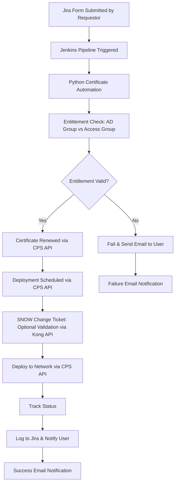
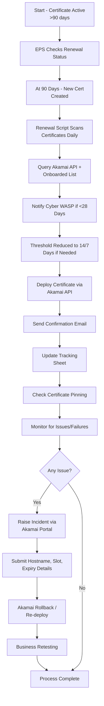
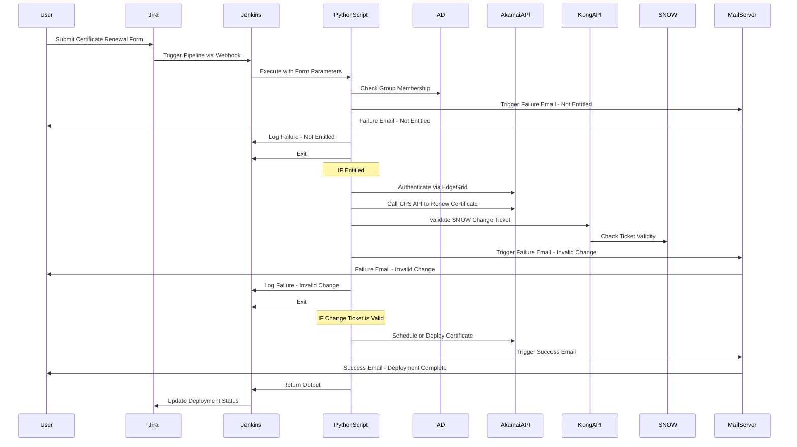

# Akamai Certificate Renewal Automation - High Level Design

## Objective

To replace the legacy Ansible-based solution for Akamai certificate renewals with a Python-based automation framework that:

- Leverages Akamai CPS APIs directly  
- Integrates into Jira and Jenkins for workflow and scheduling  
- Eliminates static spreadsheet-based entitlement models  
- Supports enterprise-grade security with AD group enforcement and secrets via Vault  

---

## Key Components

### Python Module

All logic will be consolidated into a single Python module, aligned with existing onboarding practices.

| Function               | Description                                                                 |
|------------------------|-----------------------------------------------------------------------------|
| Session Setup          | Establish Akamai EdgeGrid-authenticated session using .edgerc               |
| Entitlement Check      | Validate user's group membership against AD Group linked to the Access Group|
| Renew Certificate      | CPS API interaction to renew/enroll certificate                             |
| Deployment Scheduling  | CPS API call to schedule deployment (after approval)                        |
| Deployment Execution   | API call to deploy cert to network                                          |
| Status Tracking        | Periodic polling of enrollment/deployment status                            |
| Jira Logging           | Updates Jira issue with execution results                                   |
| Error Handling         | Logs failures to Jira and stops execution                                   |

---

h3. Certificate Renewal Flow

The diagram below outlines the key decision points and logical steps in the certificate renewal process, including entitlement validation, CPS renewal, and deployment sequencing.

## Architectural Overview (Mermaid Flowchart)

---

## Flowchart - Certificate Lifecycle

---

## Sequence Diagram - Full Flow

---
## Secrets Management with Vault

- Akamai credentials (EdgeGrid tokens) are securely retrieved from Vault.
- RBAC is enforced per subaccount.
- Secrets are audited, rotated, and TTL is applied.

---

## Entitlement Enforcement & ServiceNow Controls

### AD Group Validation

- Before triggering a renewal, the user's Active Directory (AD) group membership is validated.
- Only authorized groups mapped to the specific FQDN can initiate certificate renewals.

### ServiceNow/Deployment Controls

- Integration with Kong API is used to validate the ServiceNow Change Ticket (SNOW).
- Only approved changes proceed to certificate deployment.

---

## Certificate Pinning

- If certificate pinning is enabled, ISTO must confirm readiness to accept the new certificate.
- The pinning check occurs *after certificate renewal* but *before deployment*.
- A notification is sent to the relevant stakeholders including the certificate to be pinned.

---

## Benefits

| Legacy Limitation                  | New Design Improvement                                            |
|-----------------------------------|-------------------------------------------------------------------|
| Spreadsheet-based entitlement     | Real-time AD Group validation                                     |
| Hardcoded secrets                 | Vault-based dynamic secret injection                              |
| No structured workflow            | Jira-triggered automation with pipeline logic                     |
| Manual cert handling              | Automated CPS renewals and deployments                            |
| No change control link            | Optional SNOW Change ticket validation via Kong API               |
| Static observability              | Dynamic Jira logging and error propagation                        |
