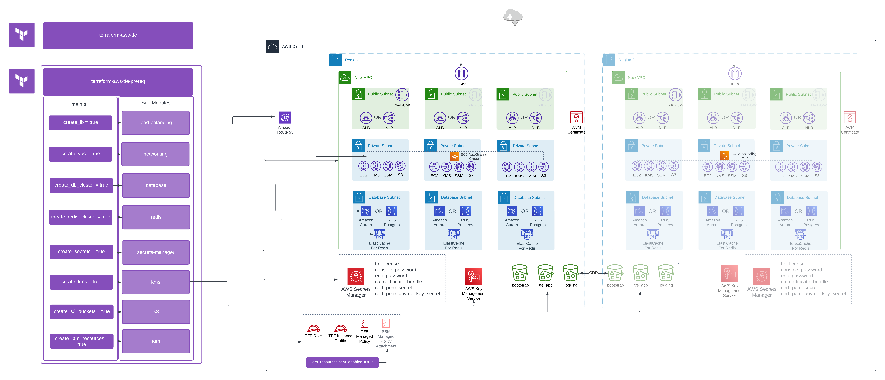

# TFE on AWS Prereqs
This Terraform module is intended to assist with the provisioning of prerequisite resources that are required for a TFE on AWS deployment. Every environment is different, and so this module may not be all-encompassing for every situation. However, this module calls upon submodules that are flexible for the core resources that are necessary in common deployment scenarios.  Utilizing this module in combination with the [terraform-aws-tfe](https://github.com/hashicorp-modules/terraform-aws-tfe) module will deploy a complete TFE deployment inside of AWS.  The separation of the two modules is to limit blast radius from issues with either modules constructs.  

&nbsp;

## Purpose
These modules are currently for [hyper-specialized tier partners](https://www.hashicorp.com/partners/find-a-partner?category=systems-integrators), internal use, and HashiCorp Implementation Services. Please reach out in #team-ent-deployment-modules if you want to use this with your customers.

## Usage
This module utilizes submodules that are required components for a TFE installation on AWS.  These modules are created in such a way that a calling root module can indicate whether or not specific parameters are customized by the caller, or left as defaults. In addition, each of the submodules can be enabled or disabled via boolean values that match the naming convention of `create_<module>`.   

Each submodule has various input variables that have sane defaults applied such that callers should be able to deploy TFE pre-requisites onto AWS with minimal input.  However, variables exist for multiple custom configurations of each of the submodules.  Please see the variable inputs to determine what settings can be set as well as their defaults.  In addition, refer to the [Example Scenarios](#example-scenarios) section for different deployment example types.  All that is required to deploy is populating your own variable values in the `terraform.auto.tfvars` template that is provided in the given scenario subdirectory.  

An overview of the module architecture is provided in [LucidChart](https://lucid.app/lucidchart/9bf9c5f3-cfbf-4262-9990-f965fb7a138d/edit?invitationId=inv_56f1eba4-910f-418a-97e6-5ff4036db164&page=0_0) . Each submodule is stored as a layer such that you can enable/disable their view as it relates to the architecture.  This can be toggled by selecting the layer button on the turning on and off the visibility of each layer as needed.

### Example Scenarios. 
- [private-tfe-active-active-alb](./examples/private-tfe-active-active-alb/README.md)
- [private-tfe-active-active-nlb](./examples/private-tfe-active-active-nlb/README.md)
- [private-tfe-single-site-airgap-alb](./examples/private-tfe-single-site-airgap-alb/README.md)
- [public-tfe-active-active-alb](./examples/public-tfe-active-active-alb/README.md) 
- [public-tfe-active-active-alb](./examples/public-tfe-active-active-alb/README.md)
- [public-tfe-active-standby-aurora-alb](./examples/public-tfe-active-standby-aurora-alb/README.md)
- [public-tfe-active-standby-aurora-nlb](./examples/public-tfe-active-standby-aurora-nlb/README.md)
- [public-tfe-single-site-aurora-alb](./examples/public-tfe-single-site-aurora-alb/README.md)
- [public-tfe-single-site-aurora-nlb](./examples/public-tfe-single-site-aurora-nlb/README.md)
- [public-tfe-single-site-postgres-rds-multi-az-alb](./examples/public-tfe-single-site-postgres-rds-multi-az-alb/README.md)

&nbsp;

## High Level Overview

Here is a high level overview for those that are unable to access the Lucid url. This outlines what components are created based on the boolean values that are supplied and the submodules that are executed as a result.

## Licensing TFE  
The TFE license will be uploaded into Secrets Manager and will be required by TFE.  Ensure that you have a TFE License in the same directory of your calling module to ensure that it is uploaded into Secrets Manager.  The details from Secrets Manager will be pulled into the `user_data` of the EC2 at boot to configure TFE.  For more information, view the `Readme` in the Secrets Manager Module

## Submodules in use:

- [terraform-aws-ent-prereq-networking](https://github.com/hashicorp-modules/terraform-aws-ent-prereq-networking)
- [terraform-aws-ent-prereq-s3](https://github.com/hashicorp-modules/terraform-aws-ent-prereq-s3)
- [terraform-aws-ent-prereq-ingress](https://github.com/hashicorp-modules/terraform-aws-ent-prereq-ingress)
- [terraform-aws-ent-prereq-kms](https://github.com/hashicorp-modules/terraform-aws-ent-prereq-kms)
- [terraform-aws-ent-prereq-iam](https://github.com/hashicorp-modules/terraform-aws-ent-prereq-iam)
- [terraform-aws-ent-prereq-database](https://github.com/hashicorp-modules/terraform-aws-ent-prereq-database)
- [terraform-aws-ent-prereq-redis](https://github.com/hashicorp-modules/terraform-aws-ent-prereq-redis)
- [terraform-aws-ent-prereq-secrets-manager](https://github.com/hashicorp-modules/terraform-aws-ent-prereq-secrets-manager)
- [terraform-null-cloudinit-function-template](https://github.com/hashicorp-modules/terraform-null-cloudinit-function-template)
<!-- BEGIN_TF_DOCS -->
## Requirements

| Name | Version |
|------|---------|
|  [terraform](#requirement\_terraform) | >= 1.5.0 |
|  [aws](#requirement\_aws) | >= 4.0.0 |
|  [random](#requirement\_random) | ~> 3.5.0 |

## Providers

| Name | Version |
|------|---------|
|  [aws](#provider\_aws) | >= 4.0.0 |
|  [random](#provider\_random) | ~> 3.5.0 |

## Modules

| Name | Source | Version |
|------|--------|---------|
|  [database](#module\_database) | github.com/hashicorp-modules/terraform-aws-ent-prereq-database | v0.1.0 |
|  [iam](#module\_iam) | github.com/hashicorp-modules/terraform-aws-ent-prereq-iam | v0.1.0 |
|  [ingress](#module\_ingress) | github.com/hashicorp-modules/terraform-aws-ent-prereq-ingress | v0.1.0-alpha |
|  [kms](#module\_kms) | github.com/hashicorp-modules/terraform-aws-ent-prereq-kms | v0.1.1 |
|  [networking](#module\_networking) | github.com/hashicorp-modules/terraform-aws-ent-prereq-networking | v0.2.0 |
|  [redis](#module\_redis) | github.com/hashicorp-modules/terraform-aws-ent-prereq-redis | v0.2.1 |
|  [s3](#module\_s3) | github.com/hashicorp-modules/terraform-aws-ent-prereq-s3 | v0.0.4 |
|  [secrets\_manager](#module\_secrets\_manager) | github.com/hashicorp-modules/terraform-aws-ent-prereq-secrets-manager | v0.0.6 |

## Resources

| Name | Type |
|------|------|
| [aws_cloudwatch_log_group.tfe](https://registry.terraform.io/providers/hashicorp/aws/latest/docs/resources/cloudwatch_log_group) | resource |
| [aws_key_pair.ssh](https://registry.terraform.io/providers/hashicorp/aws/latest/docs/resources/key_pair) | resource |
| [random_id.pre_req_rid](https://registry.terraform.io/providers/hashicorp/random/latest/docs/resources/id) | resource |
| [aws_region.current](https://registry.terraform.io/providers/hashicorp/aws/latest/docs/data-sources/region) | data source |

## Inputs

| Name | Description | Type | Default | Required |
|------|-------------|------|---------|:--------:|
|  [friendly\_name\_prefix](#input\_friendly\_name\_prefix) | Friendly name prefix used for tagging and naming AWS resources. | `string` | n/a | yes |
|  [iam\_resources](#input\_iam\_resources) | A list of objects for to be referenced in an IAM policy for the instance.  Each is a list of strings that reference infra related to the install | <pre>object({     bucket_arns             = optional(list(string), [])     kms_key_arns            = optional(list(string), [])     secret_manager_arns     = optional(list(string), [])     log_group_arn           = optional(string, "")     log_forwarding_enabled  = optional(bool, true)     role_name               = optional(string, "tfe-role")     policy_name             = optional(string, "tfe-policy")     ssm_enable              = optional(bool, false)     custom_tbw_ecr_repo_arn = optional(string, "")   })</pre> | n/a | yes |
|  [asg\_service\_iam\_role\_custom\_suffix](#input\_asg\_service\_iam\_role\_custom\_suffix) | Custom suffix for the AWS Service Linked Role.  AWS IAM only allows unique names.  Leave blank with create\_asg\_service\_iam\_role to create the Default Service Linked Role, or add a value to create a secondary role for use with this module | `string` | `""` | no |
|  [cloudwatch\_kms\_key\_arn](#input\_cloudwatch\_kms\_key\_arn) | KMS key that cloudwatch will use. If not specified, the kms key that is created will be used. | `string` | `null` | no |
|  [common\_tags](#input\_common\_tags) | Map of common tags for all taggable AWS resources. | `map(string)` | `{}` | no |
|  [create\_asg\_service\_iam\_role](#input\_create\_asg\_service\_iam\_role) | Boolean to create a service linked role for AWS Auto Scaling.  This is required to be created prior to the KMS Key Policy.  This may or may not exist in an AWS Account and needs to be explicilty determined | `bool` | `false` | no |
|  [create\_db\_cloudwatch\_log\_group](#input\_create\_db\_cloudwatch\_log\_group) | Determines whether a CloudWatch log group is created for each `enabled_cloudwatch_logs_exports` | `bool` | `true` | no |
|  [create\_db\_cluster](#input\_create\_db\_cluster) | Boolean that when true will create a cluster for PostgreSQL to use for an Active/Standby configuration. | `bool` | `true` | no |
|  [create\_db\_cluster\_parameter\_group](#input\_create\_db\_cluster\_parameter\_group) | Boolean that when true will create a database cluster parameter group for the TFE database cluster to use (if var.create\_database is true). | `bool` | `true` | no |
|  [create\_db\_global\_cluster](#input\_create\_db\_global\_cluster) | Boolean that when true will create a global cluster for Aurora to use for an Active/Standby configuration. | `bool` | `false` | no |
|  [create\_db\_parameter\_group](#input\_create\_db\_parameter\_group) | Boolean that when true will create a database parameter group for the TFE database cluster to use (if var.create\_database is true). | `bool` | `true` | no |
|  [create\_db\_security\_group](#input\_create\_db\_security\_group) | Boolean that when true will create the security groups for the database cluster to use (if var.create\_database is true) | `bool` | `true` | no |
|  [create\_db\_subnet\_group](#input\_create\_db\_subnet\_group) | Boolean that when true, will create the database subnet for the database cluster. | `bool` | `false` | no |
|  [create\_iam\_resources](#input\_create\_iam\_resources) | Flag to create IAM Resources | `bool` | `true` | no |
|  [create\_kms](#input\_create\_kms) | Boolean that when true will create the KMS keys for the S3 buckets to use | `bool` | `true` | no |
|  [create\_lb](#input\_create\_lb) | Boolean value to indicate to create a LoadBalancer | `bool` | `true` | no |
|  [create\_lb\_certificate](#input\_create\_lb\_certificate) | Boolean that when true will create the SSL certificate for the ALB to use. | `bool` | `true` | no |
|  [create\_lb\_security\_groups](#input\_create\_lb\_security\_groups) | Boolean that when true will create the required security groups for the load balancers to use. | `bool` | `true` | no |
|  [create\_log\_group](#input\_create\_log\_group) | Boolean that when true will create the cloud watch log group. | `bool` | `true` | no |
|  [create\_redis\_replication\_group](#input\_create\_redis\_replication\_group) | Boolean that determines if the pre-requisites for an active active deployment of TFE will be deployed. | `bool` | `false` | no |
|  [create\_s3\_buckets](#input\_create\_s3\_buckets) | Boolean that when true will create the S3 buckets that TFE will use | `bool` | `true` | no |
|  [create\_secrets](#input\_create\_secrets) | Boolean that when true will create the required secrets and store them in AWS Secrets Manager for the installation. If this is not set to true then the ARNs for the required secrets must be specified | `bool` | `true` | no |
|  [create\_ssh\_keypair](#input\_create\_ssh\_keypair) | Boolean to deploy TFE SSH key pair. This does not create the private key, it only creates the key pair with a provided public key. | `bool` | `false` | no |
|  [create\_vpc](#input\_create\_vpc) | Boolean that when true will create a VPC for Terraform Enterprise to use. If this is false then a vpc\_id must be provided. | `bool` | `true` | no |
|  [database\_subnets](#input\_database\_subnets) | List of database subnets CIDR ranges to create in VPC. | `list(string)` | <pre>[   "10.1.20.0/24",   "10.1.21.0/24",   "10.1.22.0/24" ]</pre> | no |
|  [db\_allocated\_storage](#input\_db\_allocated\_storage) | The amount of storage in gibibytes (GiB) to allocate to each DB instance in the Multi-AZ DB cluster. (This setting is required to create a Multi-AZ DB cluster) | `number` | `256` | no |
|  [db\_allow\_major\_version\_upgrade](#input\_db\_allow\_major\_version\_upgrade) | Boolean that when true allows major engine version upgrades when changing engine versions. | `bool` | `false` | no |
|  [db\_allowed\_cidr\_blocks](#input\_db\_allowed\_cidr\_blocks) | A list of CIDR blocks which are allowed to access the database | `list(string)` | `[]` | no |
|  [db\_apply\_immediately](#input\_db\_apply\_immediately) | Boolean that when true will apply any changes to the cluster immediately instead of waiting until the next maintenance window. | `bool` | `true` | no |
|  [db\_auto\_minor\_version\_upgrade](#input\_db\_auto\_minor\_version\_upgrade) | Indicates that minor engine upgrades will be applied automatically to the DB instance during the maintenance window. Default `true` | `bool` | `true` | no |
|  [db\_autoscaling\_enabled](#input\_db\_autoscaling\_enabled) | Boolean that when true will enable auto scaling of the aurora postgres cluster. | `bool` | `false` | no |
|  [db\_autoscaling\_max\_capacity](#input\_db\_autoscaling\_max\_capacity) | Maximum number of nodes that has to be present in the autoscaling group when db\_autoscaling\_enabled is set to true. | `number` | `3` | no |
|  [db\_autoscaling\_min\_capacity](#input\_db\_autoscaling\_min\_capacity) | Minimum number of nodes that has to be present in the autoscaling group when db\_autoscaling\_enabled is set to true. | `number` | `1` | no |
|  [db\_autoscaling\_policy\_name](#input\_db\_autoscaling\_policy\_name) | Autoscaling policy name | `string` | `"target-metric"` | no |
|  [db\_autoscaling\_predefined\_metric\_type](#input\_db\_autoscaling\_predefined\_metric\_type) | The metric type to scale on. Valid values are `RDSReaderAverageCPUUtilization` and `RDSReaderAverageDatabaseConnections` | `string` | `"RDSReaderAverageCPUUtilization"` | no |
|  [db\_autoscaling\_scale\_in\_cooldown](#input\_db\_autoscaling\_scale\_in\_cooldown) | Cooldown in seconds before allowing further scaling operations after a scale in | `number` | `300` | no |
|  [db\_autoscaling\_scale\_out\_cooldown](#input\_db\_autoscaling\_scale\_out\_cooldown) | Cooldown in seconds before allowing further scaling operations after a scale out | `number` | `300` | no |
|  [db\_autoscaling\_target\_connections](#input\_db\_autoscaling\_target\_connections) | Average number of connections threshold which will initiate autoscaling. Default value is 70% of db.r4/r5/r6g.large's default max\_connections | `number` | `700` | no |
|  [db\_autoscaling\_target\_cpu](#input\_db\_autoscaling\_target\_cpu) | CPU threshold which will initiate autoscaling | `number` | `70` | no |
|  [db\_availability\_zones](#input\_db\_availability\_zones) | List of EC2 Availability Zones for the DB cluster storage where DB cluster instances can be created. RDS automatically assigns 3 AZs if less than 3 AZs are configured, which will show as a difference requiring resource recreation next Terraform apply | `list(string)` | `null` | no |
|  [db\_backup\_retention\_period](#input\_db\_backup\_retention\_period) | The number of days to retain backups for. Must be between 0 and 35. Must be greater than 0 if the database is used as a source for a Read Replica. | `number` | `35` | no |
|  [db\_ca\_cert\_identifier](#input\_db\_ca\_cert\_identifier) | The identifier of the CA certificate for the DB instance | `string` | `null` | no |
|  [db\_cloudwatch\_log\_exports](#input\_db\_cloudwatch\_log\_exports) | Set of log types to export to cloudwatch. If omitted, no logs will be exported. The following log types are supported: `audit`, `error`, `general`, `slowquery`, `postgresql` | `list(string)` | <pre>[   "postgresql" ]</pre> | no |
|  [db\_cloudwatch\_retention\_days](#input\_db\_cloudwatch\_retention\_days) | The number of days to retain CloudWatch logs for the DB instance | `number` | `7` | no |
|  [db\_cluster\_instance\_class](#input\_db\_cluster\_instance\_class) | Instance class of the PostgreSQL database. | `string` | `"db.r6g.xlarge"` | no |
|  [db\_cluster\_instance\_parameter\_group\_name](#input\_db\_cluster\_instance\_parameter\_group\_name) | Instance parameter group to associate with all instances of the DB cluster. The `db_cluster_db_instance_parameter_group_name` is only valid in combination with `db_allow_major_version_upgrade` | `string` | `null` | no |
|  [db\_cluster\_parameter\_group\_description](#input\_db\_cluster\_parameter\_group\_description) | Description that will be attatched to the database parameter group if create\_db\_parameter\_group is set to true. | `string` | `"Database cluster parameter group for the databases that are used for Terraform Enterprise."` | no |
|  [db\_cluster\_parameter\_group\_family](#input\_db\_cluster\_parameter\_group\_family) | Family of PostgreSQL DB cluster parameter group. | `string` | `"aurora-postgresql14"` | no |
|  [db\_cluster\_parameter\_group\_name](#input\_db\_cluster\_parameter\_group\_name) | Name of the database cluster parameter group that will be created (if specified) or consumed if create\_db\_cluster\_parameter\_group is false. | `string` | `"tfe-database-cluster-parameter-group"` | no |
|  [db\_cluster\_parameter\_group\_parameters](#input\_db\_cluster\_parameter\_group\_parameters) | A list of DB cluster parameters to apply. Note that parameters may differ from a family to an other. | `list(map(string))` | `[]` | no |
|  [db\_copy\_tags\_to\_snapshot](#input\_db\_copy\_tags\_to\_snapshot) | Boolean to enable copying all cluster tags to the snapshot. | `bool` | `true` | no |
|  [db\_create\_monitoring\_role](#input\_db\_create\_monitoring\_role) | Determines whether to create the IAM role for RDS enhanced monitoring | `bool` | `true` | no |
|  [db\_database\_name](#input\_db\_database\_name) | Name of database that will be created (if specified) or consumed by TFE. | `string` | `"tfe"` | no |
|  [db\_deletion\_protection](#input\_db\_deletion\_protection) | If the DB instance should have deletion protection enabled. The database can't be deleted when this value is set to `true`. The default is `false` | `bool` | `false` | no |
|  [db\_engine](#input\_db\_engine) | Database engine type that will be configured. Valid values are `aurora-postgresql` and `postgres` | `string` | `"aurora-postgresql"` | no |
|  [db\_engine\_mode](#input\_db\_engine\_mode) | Database engine mode. | `string` | `"provisioned"` | no |
|  [db\_engine\_version](#input\_db\_engine\_version) | Database engine version. | `number` | `14.5` | no |
|  [db\_final\_snapshot\_identifier\_prefix](#input\_db\_final\_snapshot\_identifier\_prefix) | Prefix that will be associated with the final snapshot for the database instance | `string` | `"tfe"` | no |
|  [db\_global\_cluster\_id](#input\_db\_global\_cluster\_id) | Aurora Global Database cluster identifier. Intended to be used by Aurora DB Cluster instance in Secondary region. | `string` | `null` | no |
|  [db\_global\_deletion\_protection](#input\_db\_global\_deletion\_protection) | If the Global DB instance should have deletion protection enabled. The database can't be deleted when this value is set to `true`. The default is `false` | `bool` | `false` | no |
|  [db\_iam\_authentication\_enabled](#input\_db\_iam\_authentication\_enabled) | Specifies whether or mappings of AWS Identity and Access Management (IAM) accounts to database accounts is enabled | `bool` | `null` | no |
|  [db\_instance\_class](#input\_db\_instance\_class) | Instance class that will be applied to all of the autoscaling nodes for the PostgreSQL database if db\_enable\_autoscaling is set to true. | `string` | `"db.r6g.xlarge"` | no |
|  [db\_instances](#input\_db\_instances) | Number of instances to deploy. | `number` | `"2"` | no |
|  [db\_iops](#input\_db\_iops) | The amount of Provisioned IOPS (input/output operations per second) to be initially allocated for each DB instance in the Multi-AZ DB cluster | `number` | `3000` | no |
|  [db\_is\_primary\_cluster](#input\_db\_is\_primary\_cluster) | Determines whether cluster is primary cluster with writer instance (set to `false` for global cluster and replica clusters) | `bool` | `true` | no |
|  [db\_kms\_key\_arn](#input\_db\_kms\_key\_arn) | ARN of KMS key that will be used to encrypt the storage for the database instances. | `string` | `null` | no |
|  [db\_monitoring\_interval](#input\_db\_monitoring\_interval) | The interval, in seconds, between points when Enhanced Monitoring metrics are collected for instances. Set to `0` to disable. Default is `0` | `number` | `0` | no |
|  [db\_monitoring\_role\_arn](#input\_db\_monitoring\_role\_arn) | IAM role used by RDS to send enhanced monitoring metrics to CloudWatch | `string` | `""` | no |
|  [db\_parameter\_group\_description](#input\_db\_parameter\_group\_description) | Description that will be attatched to the database parameter group if create\_db\_parameter\_group is set to true. | `string` | `"Database parameter group for the databases that are used for Terraform Enterprise."` | no |
|  [db\_parameter\_group\_family](#input\_db\_parameter\_group\_family) | Family of Aurora PostgreSQL DB Parameter Group. | `string` | `"aurora-postgresql14"` | no |
|  [db\_parameter\_group\_name](#input\_db\_parameter\_group\_name) | Name of the database parameter group that will be created (if specified) or consumed if create\_db\_cluster\_parameter\_group is false. | `string` | `"tfe-database-parameter-group"` | no |
|  [db\_parameter\_group\_parameters](#input\_db\_parameter\_group\_parameters) | A list of DB cluster parameters to apply. Note that parameters may differ from a family to an other. | `list(map(string))` | `[]` | no |
|  [db\_password](#input\_db\_password) | Password for the DB user. | `string` | `null` | no |
|  [db\_performance\_insights\_enabled](#input\_db\_performance\_insights\_enabled) | Specifies whether Performance Insights is enabled or not | `bool` | `false` | no |
|  [db\_performance\_insights\_kms\_key\_arn](#input\_db\_performance\_insights\_kms\_key\_arn) | The ARN for the KMS key to encrypt Performance Insights data | `string` | `null` | no |
|  [db\_performance\_insights\_retention\_period](#input\_db\_performance\_insights\_retention\_period) | Amount of time in days to retain Performance Insights data. Either 7 (7 days) or 731 (2 years) | `number` | `null` | no |
|  [db\_port](#input\_db\_port) | The port on which the DB accepts connections. Defaults to the default db port for what you are deploying if null. | `number` | `5432` | no |
|  [db\_preferred\_backup\_window](#input\_db\_preferred\_backup\_window) | Daily time range (UTC) for RDS backup to occur. Must not overlap with `db_preferred_maintenance_window` if specified. | `string` | `"04:00-04:30"` | no |
|  [db\_preferred\_maintenance\_window](#input\_db\_preferred\_maintenance\_window) | Window (UTC) to perform database maintenance. Must not overlap with `db_preferred_backup_window` if specified. | `string` | `"Sun:08:00-Sun:09:00"` | no |
|  [db\_publicly\_accessible](#input\_db\_publicly\_accessible) | Determines whether the database is publicly accessible. | `bool` | `false` | no |
|  [db\_security\_group\_description](#input\_db\_security\_group\_description) | The description of the security group. If value is set to empty string it will contain cluster name in the description | `string` | `null` | no |
|  [db\_skip\_final\_snapshot](#input\_db\_skip\_final\_snapshot) | Determines whether a final snapshot is created before the cluster is deleted. If true is specified, no snapshot is created | `bool` | `false` | no |
|  [db\_source\_region](#input\_db\_source\_region) | Source region for Aurora Cross-Region Replication. Only specify for Secondary instance. | `string` | `null` | no |
|  [db\_storage\_encrypted](#input\_db\_storage\_encrypted) | Boolean that when set to true will use the kms\_key\_arn that has been provided via the inputs to this module | `bool` | `true` | no |
|  [db\_storage\_type](#input\_db\_storage\_type) | Specifies the storage type to be associated with the DB cluster. (This setting is required to create a Multi-AZ DB cluster). Valid values: `io1`, Default: `io1` | `string` | `"io1"` | no |
|  [db\_subnet\_group\_name](#input\_db\_subnet\_group\_name) | The name of the subnet group name (existing or created). | `string` | `""` | no |
|  [db\_subnet\_ids](#input\_db\_subnet\_ids) | A list of subnets IDs that will be used when creating the subnet group. If this is passed in along with create\_db\_subnet\_group = true and a subnet group isn't then it will be created based on the IDs in this list. | `list(string)` | `[]` | no |
|  [db\_username](#input\_db\_username) | Username for the DB user. | `string` | `"tfe"` | no |
|  [db\_vpc\_security\_group\_ids](#input\_db\_vpc\_security\_group\_ids) | List of VPC security groups to associate to the cluster. These will be associated along with the security groups that are created (if specified). | `list(string)` | `[]` | no |
|  [kms\_allow\_asg\_to\_cmk](#input\_kms\_allow\_asg\_to\_cmk) | Boolen to create a KMS CMK Key policy that grants the Service Linked Role AWSServiceRoleForAutoScaling permissions to the CMK. | `bool` | `true` | no |
|  [kms\_asg\_role\_arn](#input\_kms\_asg\_role\_arn) | ARN of AWS Service Linked role for AWS Autoscaling. | `string` | `""` | no |
|  [kms\_default\_policy\_enabled](#input\_kms\_default\_policy\_enabled) | Enables a default policy that allows KMS operations to be defined by IAM | `string` | `true` | no |
|  [kms\_key\_deletion\_window](#input\_kms\_key\_deletion\_window) | Duration in days to destroy the key after it is deleted. Must be between 7 and 30 days. | `number` | `7` | no |
|  [kms\_key\_description](#input\_kms\_key\_description) | Description that will be attached to the KMS key (if created) | `string` | `"AWS KMS Customer-managed key to encrypt TFE RDS, S3, EBS, etc."` | no |
|  [kms\_key\_name](#input\_kms\_key\_name) | Name that will be added to the KMS key via tags | `string` | `"kms-key"` | no |
|  [kms\_key\_usage](#input\_kms\_key\_usage) | Intended use of the KMS key that will be created. | `string` | `"ENCRYPT_DECRYPT"` | no |
|  [kms\_key\_users\_or\_roles](#input\_kms\_key\_users\_or\_roles) | List of arns for users or roles that should have access to perform Cryptographic Operations with KMS Key | `list(string)` | `[]` | no |
|  [lb\_certificate\_arn](#input\_lb\_certificate\_arn) | Bring your own certificate ARN | `string` | `null` | no |
|  [lb\_internal](#input\_lb\_internal) | Boolean to determine if the Load Balancer will be internal or internet facing | `bool` | `false` | no |
|  [lb\_listener\_details](#input\_lb\_listener\_details) | Configures the LB Listeners for TFE | <pre>object({     tfe_api = optional(object({       create      = optional(bool, true)       port        = optional(number, 443)       ssl_policy  = optional(string, "ELBSecurityPolicy-2016-08")       action_type = optional(string, "forward")     }), {})     tfe_console = optional(object({       create      = optional(bool, true)       port        = optional(number, 8800)       ssl_policy  = optional(string, "ELBSecurityPolicy-2016-08")       action_type = optional(string, "forward")     }), {})   })</pre> | `{}` | no |
|  [lb\_name](#input\_lb\_name) | Name of the Load Balancer to be deployed | `string` | `"lb"` | no |
|  [lb\_security\_group\_ids](#input\_lb\_security\_group\_ids) | Optional list of security group IDs to be used if providing security groups created outside of this module | `list(string)` | `[]` | no |
|  [lb\_sg\_rules\_details](#input\_lb\_sg\_rules\_details) | Object map for various Security Group Rules as pertains to the Load Balancer for TFE | <pre>object({     tfe_api_ingress = optional(object({       type        = optional(string, "ingress")       create      = optional(bool, true)       from_port   = optional(string, "443")       to_port     = optional(string, "443")       protocol    = optional(string, "tcp")       cidr_blocks = optional(list(string), [])       description = optional(string, "Allow 443 traffic inbound for TFE")     }), {})     tfe_console_ingress = optional(object({       type        = optional(string, "ingress")       create      = optional(bool, true)       from_port   = optional(string, "8800")       to_port     = optional(string, "8800")       protocol    = optional(string, "tcp")       cidr_blocks = optional(list(string), [])       description = optional(string, "Allow 8800 traffic inbound for TFE")     }), {})     egress = optional(object({       create      = optional(bool, true)       type        = optional(string, "egress")       from_port   = optional(string, "0")       to_port     = optional(string, "0")       protocol    = optional(string, "-1")       cidr_blocks = optional(list(string), ["0.0.0.0/0"])       description = optional(string, "Allow traffic outbound for TFE")     }), {})   })</pre> | `{}` | no |
|  [lb\_subnet\_ids](#input\_lb\_subnet\_ids) | List of Subnet IDs to deploy Load Balancer into | `list(string)` | `[]` | no |
|  [lb\_target\_groups](#input\_lb\_target\_groups) | Object map that creates the LB target groups for the enterprise products | <pre>object({     tfe_api = optional(object({       create               = optional(bool, true)       description          = optional(string, "Target Group for TLS API/Web application traffic")       name                 = optional(string, "tfe-tls-tg")       deregistration_delay = optional(number, 60)       port                 = optional(number, 443)       protocol             = optional(string, "HTTPS")       health_check = optional(object({         enabled             = optional(bool, true)         port                = optional(number, 443)         healthy_threshold   = optional(number, 2)         unhealthy_threshold = optional(number, 3)         timeout             = optional(number, 5)         interval            = optional(number, 15)         matcher             = optional(string, "200")         path                = optional(string, "/_health_check")         protocol            = optional(string, "HTTPS")       }), {})     }), {})     tfe_console = optional(object({       create               = optional(bool, true)       name                 = optional(string, "tfe-console-tg")       description          = optional(string, "Target Group for TFE/Replicated web admin console traffic")       deregistration_delay = optional(number, 60)       port                 = optional(number, 8800)       protocol             = optional(string, "HTTPS")       health_check = optional(object({         enabled             = optional(bool, true)         port                = optional(number, 8800)         healthy_threshold   = optional(number, 2)         unhealthy_threshold = optional(number, 3)         timeout             = optional(number, 5)         interval            = optional(number, 15)         matcher             = optional(string, "200-299")         path                = optional(string, "/ping")         protocol            = optional(string, "HTTPS")       }), {})     }), {})   })</pre> | `{}` | no |
|  [lb\_type](#input\_lb\_type) | Type of load balancer that will be provisioned as a part of the module execution (if specified). | `string` | `"application"` | no |
|  [log\_group\_name](#input\_log\_group\_name) | Name of the Cloud Watch Log Group to be used for TFE Logs. | `string` | `"tfe-log-group"` | no |
|  [log\_group\_retention\_days](#input\_log\_group\_retention\_days) | Number of days to retain logs in Log Group. | `number` | `30` | no |
|  [optional\_secrets](#input\_optional\_secrets) | Optional variable that when supplied will be merged with the `secretsmanager_secrets` map. These secrets need to have the following specification:   optional\_secrets = {     secret\_1 = {       name = "supesecret"       description = "it's my secret that is important"       path = "path to file if you are using one"       data = "string data if you are supplying it"     }     secret\_2 = {       name = "supesecret2"       description = "it's my secret that is also important probably"       path = "path to file if you are using one"       data = "string data if you are supplying it"     }   } | `map(any)` | `{}` | no |
|  [private\_subnets](#input\_private\_subnets) | List of private subnet CIDR ranges to create in VPC. | `list(string)` | <pre>[   "10.1.255.0/24",   "10.1.254.0/24",   "10.1.253.0/24" ]</pre> | no |
|  [product](#input\_product) | Name of the HashiCorp product that will consume this service (tfe, tfefdo, vault, consul) | `string` | `"tfe"` | no |
|  [public\_subnets](#input\_public\_subnets) | List of public subnet CIDR ranges to create in VPC. | `list(string)` | <pre>[   "10.1.1.0/24",   "10.1.2.0/24",   "10.1.3.0/24" ]</pre> | no |
|  [redis\_enable\_encryption\_at\_rest](#input\_redis\_enable\_encryption\_at\_rest) | Boolean to enable encryption at rest on Redis replication group. A `kms_key_arn` is required when set to `true`. | `bool` | `false` | no |
|  [redis\_enable\_multi\_az](#input\_redis\_enable\_multi\_az) | Boolean for deploying Redis nodes in multiple Availability Zones and enabling automatic failover. | `bool` | `true` | no |
|  [redis\_enable\_transit\_encryption](#input\_redis\_enable\_transit\_encryption) | Boolean to enable transit encryption at rest on Redis replication group. | `bool` | `true` | no |
|  [redis\_engine](#input\_redis\_engine) | Engine that will be provisioned for the Redis replication group | `string` | `"redis"` | no |
|  [redis\_engine\_version](#input\_redis\_engine\_version) | Redis version number. | `string` | `"6.2"` | no |
|  [redis\_kms\_key\_arn](#input\_redis\_kms\_key\_arn) | ARN of KMS key that will be used to encrypt the storage for the Redis instances. | `string` | `""` | no |
|  [redis\_log\_group\_name](#input\_redis\_log\_group\_name) | Name of the Cloud Watch Log Group to be used for Redis Logs. | `string` | `""` | no |
|  [redis\_node\_type](#input\_redis\_node\_type) | Type of Redis node from a compute, memory, and network throughput standpoint. | `string` | `"cache.m5.large"` | no |
|  [redis\_parameter\_group\_name](#input\_redis\_parameter\_group\_name) | Name of parameter group to associate with Redis replication group. | `string` | `"default.redis6.x"` | no |
|  [redis\_password](#input\_redis\_password) | Password (auth token) used to enable transit encryption (TLS) with Redis. | `string` | `""` | no |
|  [redis\_port](#input\_redis\_port) | Port number the Redis nodes will accept connections on. | `number` | `6379` | no |
|  [redis\_replication\_group\_description](#input\_redis\_replication\_group\_description) | Description that will be associated with the Redis replication group | `string` | `"External Redis Replication Group for TFE Active/Active"` | no |
|  [redis\_security\_group\_ids](#input\_redis\_security\_group\_ids) | List of existing security groups to associate with the Redis replication group. If Active/Active is true and this is default, then one will be created. | `list(string)` | `[]` | no |
|  [redis\_subnet\_group\_name](#input\_redis\_subnet\_group\_name) | Name of the existing subnet group for the Redis replication group to use. | `string` | `null` | no |
|  [redis\_subnet\_ids](#input\_redis\_subnet\_ids) | List of subnet IDs to use for Redis replication group subnet group. | `list(string)` | `[]` | no |
|  [route53\_failover\_record](#input\_route53\_failover\_record) | If set, creates a Route53 failover record.  Ensure that the record name is the same between both modules.  Also, the Record ID needs to be unique per module | <pre>object({     create              = optional(bool, true)     set_id              = optional(string, "fso1")     lb_failover_primary = optional(bool, true)     record_name         = optional(string)   })</pre> | `{}` | no |
|  [route53\_private\_zone](#input\_route53\_private\_zone) | Boolean that when true, designates the data lookup to use a private Route 53 zone name | `bool` | `false` | no |
|  [route53\_record\_health\_check\_enabled](#input\_route53\_record\_health\_check\_enabled) | Enabled evaluation of target health for direct LB record | `bool` | `false` | no |
|  [route53\_zone\_name](#input\_route53\_zone\_name) | Route 53 public zone name | `string` | `""` | no |
|  [s3\_buckets](#input\_s3\_buckets) | Object Map that contains the configuration for the S3 logging and bootstrap bucket configuration. | <pre>object({     bootstrap = optional(object({       create                              = optional(bool, true)       bucket_name                         = optional(string, "tfe-bootstrap-bucket")       description                         = optional(string, "Bootstrap bucket for the TFE instances and install")       versioning                          = optional(bool, true)       force_destroy                       = optional(bool, false)       replication                         = optional(bool)       replication_destination_bucket_arn  = optional(string)       replication_destination_kms_key_arn = optional(string)       replication_destination_region      = optional(string)       encrypt                             = optional(bool, true)       bucket_key_enabled                  = optional(bool, true)       kms_key_arn                         = optional(string)       sse_s3_managed_key                  = optional(bool, false)       is_secondary_region                 = optional(bool, false)     }), {})     tfe_app = optional(object({       create                              = optional(bool, true)       bucket_name                         = optional(string, "tfe-app-bucket")       description                         = optional(string, "Object store for TFE")       versioning                          = optional(bool, true)       force_destroy                       = optional(bool, false)       replication                         = optional(bool)       replication_destination_bucket_arn  = optional(string)       replication_destination_kms_key_arn = optional(string)       replication_destination_region      = optional(string)       encrypt                             = optional(bool, true)       bucket_key_enabled                  = optional(bool, true)       kms_key_arn                         = optional(string)       sse_s3_managed_key                  = optional(bool, false)       is_secondary_region                 = optional(bool, false)     }), {})     logging = optional(object({       create                              = optional(bool, true)       bucket_name                         = optional(string, "hashicorp-log-bucket")       versioning                          = optional(bool, false)       force_destroy                       = optional(bool, false)       replication                         = optional(bool, false)       replication_destination_bucket_arn  = optional(string)       replication_destination_kms_key_arn = optional(string)       replication_destination_region      = optional(string)       encrypt                             = optional(bool, true)       bucket_key_enabled                  = optional(bool, true)       kms_key_arn                         = optional(string)       sse_s3_managed_key                  = optional(bool, false)       lifecycle_enabled                   = optional(bool, true)       lifecycle_expiration_days           = optional(number, 7)       is_secondary_region                 = optional(bool, false)     }), {})   })</pre> | `{}` | no |
|  [secretsmanager\_secrets](#input\_secretsmanager\_secrets) | Object Map that contains various TFE secrets that will be created and stored in AWS Secrets Manager. | <pre>object({     license = optional(object({       name        = optional(string, "tfe-license")       path        = optional(string, null)       description = optional(string, "TFE license")       data        = optional(string, null)     }), {})     tfe_console_password = optional(object({       name        = optional(string, "console-password")       description = optional(string, "Console password used in the TFE installation")       data        = optional(string, null)     }), {})     tfe_enc_password = optional(object({       name        = optional(string, "enc-password")       description = optional(string, "Encryption password used in the TFE installation")       data        = optional(string, null)     }), {})     ca_certificate_bundle = optional(object({       name        = optional(string, null)       path        = optional(string, null)       description = optional(string, "TFE BYO CA certificate bundle")       data        = optional(string, null)     }))     cert_pem_secret = optional(object({       name        = optional(string, null)       path        = optional(string, null)       description = optional(string, "TFE BYO PEM-encoded TLS certificate")       data        = optional(string, null)     }))     cert_pem_private_key_secret = optional(object({       name        = optional(string, null)       path        = optional(string, null)       description = optional(string, "TFE BYO PEM-encoded TLS private key")       data        = optional(string, null)     }))   })</pre> | `{}` | no |
|  [ssh\_keypair\_name](#input\_ssh\_keypair\_name) | Name of the TFE keypair that will be created or used (if it already exists). | `string` | `"tfe-keypair"` | no |
|  [ssh\_public\_key](#input\_ssh\_public\_key) | Public key material for TFE SSH Key Pair. | `string` | `null` | no |
|  [tfe\_active\_active](#input\_tfe\_active\_active) | Boolean that determines if the pre-requisites for an active active deployment of TFE will be deployed. | `bool` | `false` | no |
|  [vpc\_cidr](#input\_vpc\_cidr) | CIDR block for VPC. | `string` | `"10.1.0.0/16"` | no |
|  [vpc\_default\_security\_group\_egress](#input\_vpc\_default\_security\_group\_egress) | List of maps of egress rules to set on the default security group | `list(map(string))` | `[]` | no |
|  [vpc\_default\_security\_group\_ingress](#input\_vpc\_default\_security\_group\_ingress) | List of maps of ingress rules to set on the default security group | `list(map(string))` | `[]` | no |
|  [vpc\_enable\_ssm](#input\_vpc\_enable\_ssm) | Boolean that when true will create a security group allowing port 443 to the private\_subnets within the VPC (if create\_vpc is true) | `bool` | `false` | no |
|  [vpc\_endpoint\_flags](#input\_vpc\_endpoint\_flags) | Collection of flags to enable various VPC Endpoints | <pre>object({     create_ec2         = optional(bool, true)     create_ec2messages = optional(bool, true)     create_kms         = optional(bool, true)     create_s3          = optional(bool, true)     create_ssm         = optional(bool, true)     create_ssmmessages = optional(bool, true)   })</pre> | `{}` | no |
|  [vpc\_id](#input\_vpc\_id) | ID of the VPC that the cluster will use. (Only used if var.create\_vpc is false) | `string` | `null` | no |
|  [vpc\_name](#input\_vpc\_name) | Friendly name prefix used for tagging and naming AWS resources. | `string` | `"tfe-vpc"` | no |
|  [vpc\_option\_flags](#input\_vpc\_option\_flags) | Object map of boolean flags to enable or disable certain features of the AWS VPC | <pre>object({     create_igw                    = optional(bool, true)     enable_dns_hostnames          = optional(bool, true)     enable_dns_support            = optional(bool, true)     enable_nat_gateway            = optional(bool, true)     map_public_ip_on_launch       = optional(bool, true)     manage_default_security_group = optional(bool, true)     one_nat_gateway_per_az        = optional(bool, false)     single_nat_gateway            = optional(bool, false)   })</pre> | `{}` | no |

## Outputs

| Name | Description |
|------|-------------|
|  [acm\_certificate\_arn](#output\_acm\_certificate\_arn) | The ARN of the certificate |
|  [acm\_certificate\_status](#output\_acm\_certificate\_status) | Status of the certificate |
|  [acm\_distinct\_domain\_names](#output\_acm\_distinct\_domain\_names) | List of distinct domains names used for the validation |
|  [acm\_validation\_domains](#output\_acm\_validation\_domains) | List of distinct domain validation options. This is useful if subject alternative names contain wildcards |
|  [acm\_validation\_route53\_record\_fqdns](#output\_acm\_validation\_route53\_record\_fqdns) | List of FQDNs built using the zone domain and name |
|  [asg\_hook\_value](#output\_asg\_hook\_value) | Value for the `asg-hook` tag that will be attatched to the TFE instance in the other module. Use this value to ensure the lifecycle hook is updated during deployment. |
|  [ca\_certificate\_bundle\_secret\_arn](#output\_ca\_certificate\_bundle\_secret\_arn) | AWS Secrets Manager TFE BYO CA certificate secret ARN. |
|  [cert\_pem\_private\_key\_secret\_arn](#output\_cert\_pem\_private\_key\_secret\_arn) | AWS Secrets Manager TFE BYO CA certificate private key secret ARN. |
|  [cert\_pem\_secret\_arn](#output\_cert\_pem\_secret\_arn) | AWS Secrets Manager TFE BYO CA certificate private key secret ARN. |
|  [db\_additional\_cluster\_endpoints](#output\_db\_additional\_cluster\_endpoints) | A map of additional cluster endpoints and their attributes |
|  [db\_cluster\_arn](#output\_db\_cluster\_arn) | Amazon Resource Name (ARN) of cluster |
|  [db\_cluster\_cloudwatch\_log\_groups](#output\_db\_cluster\_cloudwatch\_log\_groups) | Map of CloudWatch log groups created and their attributes |
|  [db\_cluster\_database\_name](#output\_db\_cluster\_database\_name) | Name for an automatically created database on cluster creation |
|  [db\_cluster\_endpoint](#output\_db\_cluster\_endpoint) | Writer endpoint for the cluster |
|  [db\_cluster\_engine\_version\_actual](#output\_db\_cluster\_engine\_version\_actual) | The running version of the cluster database |
|  [db\_cluster\_id](#output\_db\_cluster\_id) | The RDS Cluster Identifier |
|  [db\_cluster\_instances](#output\_db\_cluster\_instances) | A map of cluster instances and their attributes |
|  [db\_cluster\_members](#output\_db\_cluster\_members) | List of RDS Instances that are a part of this cluster |
|  [db\_cluster\_port](#output\_db\_cluster\_port) | The database port |
|  [db\_cluster\_reader\_endpoint](#output\_db\_cluster\_reader\_endpoint) | A read-only endpoint for the cluster, automatically load-balanced across replicas |
|  [db\_cluster\_resource\_id](#output\_db\_cluster\_resource\_id) | The RDS Cluster Resource ID |
|  [db\_cluster\_role\_associations](#output\_db\_cluster\_role\_associations) | A map of IAM roles associated with the cluster and their attributes |
|  [db\_enhanced\_monitoring\_iam\_role\_arn](#output\_db\_enhanced\_monitoring\_iam\_role\_arn) | The Amazon Resource Name (ARN) specifying the enhanced monitoring role |
|  [db\_enhanced\_monitoring\_iam\_role\_name](#output\_db\_enhanced\_monitoring\_iam\_role\_name) | The name of the enhanced monitoring role |
|  [db\_enhanced\_monitoring\_iam\_role\_unique\_id](#output\_db\_enhanced\_monitoring\_iam\_role\_unique\_id) | Stable and unique string identifying the enhanced monitoring role |
|  [db\_global\_cluster\_id](#output\_db\_global\_cluster\_id) | ID of the global cluster that has been created (if specified.) |
|  [db\_password](#output\_db\_password) | The database master password |
|  [db\_security\_group\_id](#output\_db\_security\_group\_id) | The security group ID of the cluster |
|  [db\_subnet\_arns](#output\_db\_subnet\_arns) | List of ARNs of database subnets |
|  [db\_subnet\_group](#output\_db\_subnet\_group) | ID of database subnet group |
|  [db\_subnet\_group\_name](#output\_db\_subnet\_group\_name) | Name of database subnet group |
|  [db\_subnet\_ids](#output\_db\_subnet\_ids) | List of IDs of database subnets |
|  [db\_subnets\_cidr\_blocks](#output\_db\_subnets\_cidr\_blocks) | List of cidr\_blocks of database subnets |
|  [db\_subnets\_ipv6\_cidr\_blocks](#output\_db\_subnets\_ipv6\_cidr\_blocks) | List of IPv6 cidr\_blocks of database subnets in an IPv6 enabled VPC |
|  [db\_username](#output\_db\_username) | The database master username |
|  [default\_security\_group\_id](#output\_default\_security\_group\_id) | The ID of the security group created by default on VPC creation |
|  [iam\_asg\_service\_role](#output\_iam\_asg\_service\_role) | ARN of AWS Service Linked Role for AWS EC2 AutoScaling |
|  [iam\_instance\_profile](#output\_iam\_instance\_profile) | ARN of IAM Instance Profile for TFE Instance Role |
|  [iam\_managed\_policy\_arn](#output\_iam\_managed\_policy\_arn) | ARN of IAM Managed Policy for TFE Instance Role |
|  [iam\_managed\_policy\_name](#output\_iam\_managed\_policy\_name) | Name of IAM Managed Policy for TFE Instance Role |
|  [iam\_role\_arn](#output\_iam\_role\_arn) | ARN of IAM Role in use by TFE Instances |
|  [iam\_role\_name](#output\_iam\_role\_name) | Name of IAM Role in use by TFE Instances |
|  [kms\_key\_alias](#output\_kms\_key\_alias) | The KMS Key Alias |
|  [kms\_key\_alias\_arn](#output\_kms\_key\_alias\_arn) | The KMS Key Alias arn |
|  [kms\_key\_arn](#output\_kms\_key\_arn) | The KMS key used to encrypt data. |
|  [lb\_arn](#output\_lb\_arn) | The Resource Identifier of the LB |
|  [lb\_dns\_name](#output\_lb\_dns\_name) | The DNS name created with the LB |
|  [lb\_internal](#output\_lb\_internal) | Boolean value of the internal/external status of the LB.  Determines if the LB gets Elastic IPs assigned |
|  [lb\_name](#output\_lb\_name) | Name of the LB |
|  [lb\_security\_group\_ids](#output\_lb\_security\_group\_ids) | List of security group IDs in use by the LB |
|  [lb\_tg\_arns](#output\_lb\_tg\_arns) | List of target group ARNs for LB |
|  [lb\_type](#output\_lb\_type) | Type of LB created (ALB or NLB) |
|  [lb\_zone\_id](#output\_lb\_zone\_id) | The Zone ID of the LB |
|  [license\_secret\_arn](#output\_license\_secret\_arn) | AWS Secrets Manager tfe\_license secret ARN. |
|  [log\_group\_name](#output\_log\_group\_name) | AWS CloudWatch Log Group Name. |
|  [optional\_secrets](#output\_optional\_secrets) | A map of optional secrets that have been created if they were supplied during the time of execution. Output is a single map where the key of the map for the secret is the key and the ARN is the value. |
|  [private\_route\_table\_ids](#output\_private\_route\_table\_ids) | List of IDs of private route tables |
|  [private\_subnet\_arns](#output\_private\_subnet\_arns) | List of ARNs of private subnets |
|  [private\_subnet\_ids](#output\_private\_subnet\_ids) | List of IDs of private subnets |
|  [private\_subnets\_cidr\_blocks](#output\_private\_subnets\_cidr\_blocks) | List of cidr\_blocks of private subnets |
|  [private\_subnets\_ipv6\_cidr\_blocks](#output\_private\_subnets\_ipv6\_cidr\_blocks) | List of IPv6 cidr\_blocks of private subnets in an IPv6 enabled VPC |
|  [public\_route\_table\_ids](#output\_public\_route\_table\_ids) | List of IDs of public route tables |
|  [public\_subnet\_arns](#output\_public\_subnet\_arns) | List of ARNs of public subnets |
|  [public\_subnet\_ids](#output\_public\_subnet\_ids) | List of IDs of public subnets |
|  [public\_subnets\_cidr\_blocks](#output\_public\_subnets\_cidr\_blocks) | List of cidr\_blocks of public subnets |
|  [public\_subnets\_ipv6\_cidr\_blocks](#output\_public\_subnets\_ipv6\_cidr\_blocks) | List of IPv6 cidr\_blocks of public subnets in an IPv6 enabled VPC |
|  [redis\_password](#output\_redis\_password) | Auth token that is used to access the Redis replication group. |
|  [redis\_port](#output\_redis\_port) | Port that the redis cluster is listening on. |
|  [redis\_primary\_endpoint](#output\_redis\_primary\_endpoint) | Address of the endpoint of the primary node in the replication group. |
|  [redis\_replication\_group\_arn](#output\_redis\_replication\_group\_arn) | ARN of the created Redis replication group. |
|  [redis\_security\_group\_id](#output\_redis\_security\_group\_id) | ID of redis security group |
|  [redis\_security\_group\_ids](#output\_redis\_security\_group\_ids) | List of security groups that are associated with the Redis replication group. |
|  [redis\_security\_group\_name](#output\_redis\_security\_group\_name) | Name of redis security group |
|  [redis\_subnet\_arns](#output\_redis\_subnet\_arns) | List of ARNs of redis subnets |
|  [redis\_subnet\_group](#output\_redis\_subnet\_group) | ID of redis subnet group |
|  [redis\_subnet\_group\_name](#output\_redis\_subnet\_group\_name) | Name of redis subnet group |
|  [redis\_subnets](#output\_redis\_subnets) | List of IDs of redis subnets |
|  [redis\_subnets\_cidr\_blocks](#output\_redis\_subnets\_cidr\_blocks) | List of cidr\_blocks of redis subnets |
|  [redis\_subnets\_ipv6\_cidr\_blocks](#output\_redis\_subnets\_ipv6\_cidr\_blocks) | List of IPv6 cidr\_blocks of redis subnets in an IPv6 enabled VPC |
|  [region](#output\_region) | The AWS region where the resources have been created |
|  [route53\_failover\_fqdn](#output\_route53\_failover\_fqdn) | FQDN of failover LB Route53 record |
|  [route53\_failover\_record\_name](#output\_route53\_failover\_record\_name) | Name of the failover LB Route53 record name |
|  [route53\_regional\_fqdn](#output\_route53\_regional\_fqdn) | FQDN of regional LB Route53 record |
|  [route53\_regional\_record\_name](#output\_route53\_regional\_record\_name) | Name of the regional LB Route53 record name |
|  [s3\_bootstrap\_bucket\_arn](#output\_s3\_bootstrap\_bucket\_arn) | ARN of S3 'bootstrap' bucket |
|  [s3\_bootstrap\_bucket\_name](#output\_s3\_bootstrap\_bucket\_name) | Name of S3 'bootstrap' bucket. |
|  [s3\_bootstrap\_bucket\_replication\_policy](#output\_s3\_bootstrap\_bucket\_replication\_policy) | Replication policy of the S3 'bootstrap' bucket. |
|  [s3\_bucket\_arn\_list](#output\_s3\_bucket\_arn\_list) | A list of the ARNs for the buckets that have been configured |
|  [s3\_log\_bucket\_arn](#output\_s3\_log\_bucket\_arn) | Name of S3 'logging' bucket. |
|  [s3\_log\_bucket\_name](#output\_s3\_log\_bucket\_name) | Name of S3 'logging' bucket. |
|  [s3\_log\_bucket\_replication\_policy](#output\_s3\_log\_bucket\_replication\_policy) | Replication policy of the S3 'logging' bucket. |
|  [s3\_replication\_iam\_role\_arn](#output\_s3\_replication\_iam\_role\_arn) | ARN of IAM Role for S3 replication. |
|  [s3\_tfe\_app\_bucket\_arn](#output\_s3\_tfe\_app\_bucket\_arn) | ARN of the S3 Terraform Enterprise Object Store bucket. |
|  [s3\_tfe\_app\_bucket\_name](#output\_s3\_tfe\_app\_bucket\_name) | Name of S3 S3 Terraform Enterprise Object Store bucket. |
|  [s3\_tfe\_app\_bucket\_replication\_policy](#output\_s3\_tfe\_app\_bucket\_replication\_policy) | Replication policy of the S3 Terraform Enterprise Object Store bucket. |
|  [secret\_arn\_list](#output\_secret\_arn\_list) | A list of AWS Secrets Manager Arns produced by the module |
|  [ssh\_keypair\_arn](#output\_ssh\_keypair\_arn) | ARN of the keypair that was created (if specified). |
|  [ssh\_keypair\_fingerprint](#output\_ssh\_keypair\_fingerprint) | Fingerprint of the  SSH Key Pair. |
|  [ssh\_keypair\_id](#output\_ssh\_keypair\_id) | ID of the SSH Key Pair. |
|  [ssh\_keypair\_name](#output\_ssh\_keypair\_name) | Name of the keypair that was created (if specified). |
|  [tfe\_console\_password\_arn](#output\_tfe\_console\_password\_arn) | AWS Secrets Manager console\_password secret ARN. |
|  [tfe\_enc\_password\_arn](#output\_tfe\_enc\_password\_arn) | AWS Secrets Manager enc\_password secret ARN. |
|  [tls\_endpoint\_security\_group\_id](#output\_tls\_endpoint\_security\_group\_id) | ID for the TLS security group that is created for endpoint access. |
|  [tls\_endpoint\_security\_group\_name](#output\_tls\_endpoint\_security\_group\_name) | Name for the TLS security group that is created for endpoint access. |
|  [vpc\_arn](#output\_vpc\_arn) | The ARN of the VPC |
|  [vpc\_cidr\_block](#output\_vpc\_cidr\_block) | The CIDR block of the VPC |
|  [vpc\_id](#output\_vpc\_id) | The ID of the VPC |
<!-- END_TF_DOCS -->