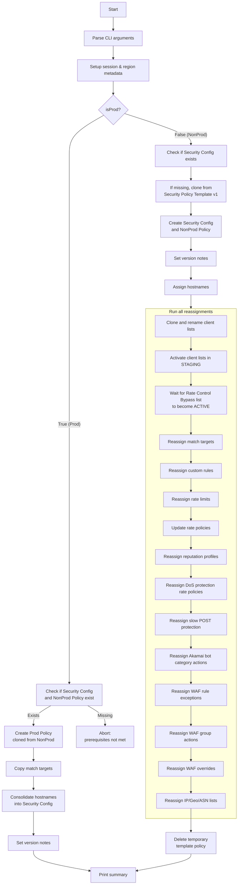

# Akamai AppSec Onboarding Tool

This repository contains a Python-based onboarding automation tool designed to create and manage Akamai Application Security configurations, policies, and related client lists in a streamlined, automated fashion. The tool supports both Non-Production and Production environment provisioning using a clear and extensible CLI-based interface.

## Overview

This tool automates:

* Creation of Security Configurations and Policies
* Cloning from a pre-defined Security Policy Template (v1)
* Assignment of match targets, rules, protections, and exception lists
* Activation of cloned client lists (e.g., Rate Control Bypass)
* Consolidation of hostnames for Production policy deployment
* Adding version notes linked to change references (e.g., Jira)

## How It Works

### 1. Parse CLI Arguments

`parse_args()` collects inputs such as:

* `--section`: EdgeGrid credentials section
* `--access_group`: Business unit or group identifier
* `--fqdn`: Comma-separated list of hostnames
* `--isProd`: Flag to determine if this is a Production deployment
* `--version-notes`: Description or ticket to annotate version creation

### 2. Session Setup

* `setup_session()` reads EdgeGrid credentials from `.edgerc`
* `get_region_from_section()` resolves contract and group ID metadata

### 3. Determine Config and Policy Names

* Security Config name: `SC-<access_group>`
* Policy name: `PL-<access_group>-NonProd` or `PL-<access_group>-Prod`

### 4. Check for Existing Config and Policy

* `config_exists()` and `policy_exists()` validate presence of SC and policy

### 5. isProd Logic

#### If `isProd=True`:

* Verify Security Config and Non-Prod policy exist
* If not, abort
* If yes:

  * Call `onboard_prod_policy()`
  * Clone from Non-Prod policy
  * Clone match targets: `clone_match_targets_for_prod()`
  * Consolidate hostnames: `build_desired_fqdns()` and `ensure_config_hostnames()`
  * Set version notes: `set_config_version_notes()`
  * Done

#### If `isProd=False`:

* If SC not found, clone new SC from template using `create_security_config()`
* Get template policy ID using `get_policy_id_from_config()`
* Clone default policy: `create_default_policy()`
* Set version notes with ticket or description
* Assign hostnames
* Run `run_all_reassignments()` to rewire all settings:

  * `clone_and_rename_client_lists()` with staging activation
    * Wait only for `Rate Controls Bypass List` to become ACTIVE
  * `reassign_match_targets()`
  * `reassign_custom_rules()`
  * `reassign_rate_limits()`
  * `update_rate_policies()`
  * `reassign_reputation_profiles()`
  * `reassign_dos_protection_rate_policies()`
  * `reassign_slow_post_protection()`
  * `reassign_akamai_bot_category_actions()`
  * `reassign_waf_rule_exceptions()`
  * `reassign_waf_group_actions()`
  * `reassign_waf_overrides()`
  * `reassign_ip_geo_asn_lists()` using `build_cloned_list_id_map()`

* Finally, remove the temporary template policy via `delete_policy()`
* Print summary and exit

## Diagram



## Usage Examples

### Non-Prod Provisioning

```bash
python akamai_appsec_onboarding_complete.py   --section default   --access_group HSBC   --fqdn app.dev.hsbc.com   --version-notes "WAFAUTOJSD-1192"   --isProd false
```

### Prod Provisioning

```bash
python akamai_appsec_onboarding_complete.py   --section default   --access_group HSBC   --fqdn app.prod.hsbc.com   --version-notes "WAFAUTOJSD-1192"   --isProd true
```