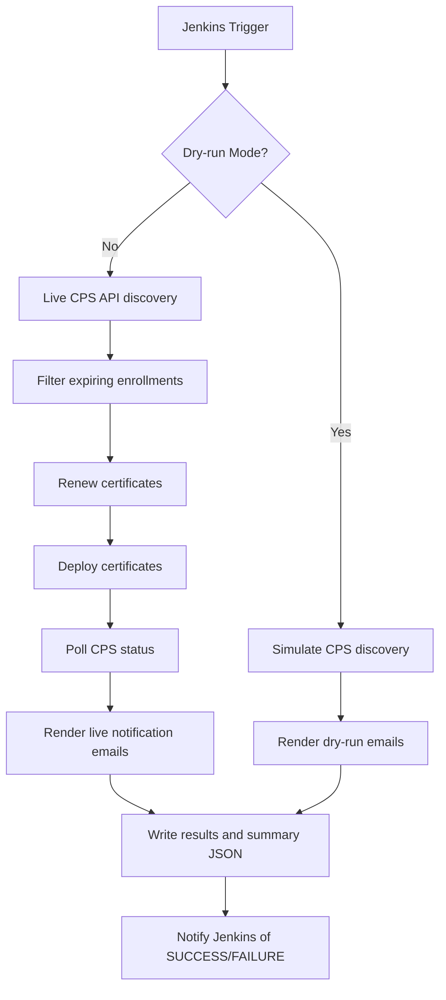
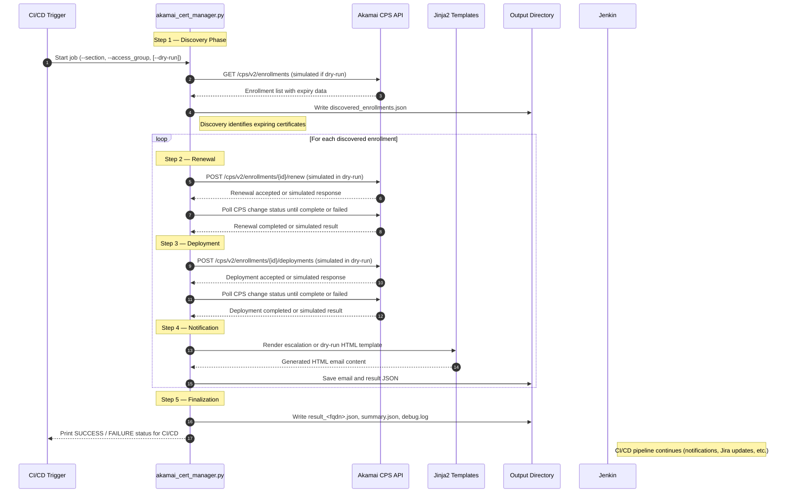

# Akamai Certificate Lifecycle Automation

## Overview

This module automates the complete certificate lifecycle for Akamai CPS (Certificate Provisioning System), including certificate renewal, deployment, polling, and notification rendering.  
It supports both **live API mode** and **dry-run simulation**, allowing safe pre-deployment validation within Jenkins pipelines or local environments.

This implementation fully replaces the previous Ansible-based automation by providing a consolidated, Python-based orchestration layer with enhanced observability, safety, and CI/CD integration.

---

## Flow Diagram


---

## Secquence Diagram



## Example Rendered Email (Dry-Run)

Below is an example of the email summary generated in **dry-run mode** using `certEmail_dryrun.j2`.  
It mimics the live production format but clearly displays the `DRY-RUN MODE` tag and simulated data.


<div class="container">
  <h1>Akamai Certificate Renewal — Dry Run Summary <span class="tag">DRY-RUN MODE</span></h1>
  <table>
    <tr><th>FQDN</th><td>test.example.com</td></tr>
    <tr><th>Enrollment ID</th><td>10001</td></tr>
    <tr><th>Expiry Date</th><td>27 Oct 2025</td></tr>
    <tr><th>Auto-Renewal Date</th><td>24 Oct 2025 09:00 UTC</td></tr>
    <tr><th>Deployment Network</th><td>production</td></tr>
  </table>
  <p><strong>No live changes were performed.</strong></p>
</div>

---

## Key Features

- Automated certificate renewal and deployment through Akamai CPS API (v2)
- Safe **dry-run simulation** that mirrors real API requests and responses
- Configurable polling with **timeout and exponential backoff**
- Automatic HTML email rendering using Jinja2 templates
- Region-aware contract and group ID mapping (`Global`, `APAC`, `EMEA`, `LATAM`, `AMER`, `DEV`)
- Structured console output (`[INFO]`, `[DEBUG]`, `[FAILURE]`, `[SUCCESS]`, `[DRY-RUN]`) for CI/CD parsing
- JSON result export and detailed debug logging for audit tracking
- Unified dry-run/live mode for consistent validation
- Secure authentication using Akamai EdgeGrid (`.edgerc`)

---

## Folder Structure

```
akamai_cert_manager/
├── akamai_cert_manager.py           # Main CPS automation module (production version)
├── templates/
│   ├── certEmail.html               # Default email template
│   ├── 7Days-EscalationNotificationEmail.html
│   ├── 10Days-EscalationNotificationEmail.html
│   ├── 14Days-EscalationNotificationEmail.html
│   └── certdata.j2                  # Raw data rendering template
├── output/
│   ├── result_<fqdn>.json           # Detailed result for each execution
│   ├── email_<fqdn>_<days>d.html    # Rendered email output
│   └── debug.log                    # Verbose log file (if debug mode enabled)
└── README.md
```

---

## Requirements

- **Python**: 3.8 or later  
- **Dependencies**:
  ```bash
  pip install requests akamai-edgegrid jinja2
  ```
- **Credentials**: Valid `.edgerc` file with the appropriate credentials and permissions.

Example `.edgerc` entry:
```ini
[DEV]
client_secret = <secret>
host = akab-xxxxx.luna.akamaiapis.net
access_token = <access>
client_token = <token>
```

---

## CLI Arguments

| Argument | Required | Description | Default |
|-----------|-----------|-------------|----------|
| `--section` | Yes | `.edgerc` section name used for authentication | — |
| `--access_group` | Yes | Access group identifier (used for audit and tagging) | — |
| `--fqdn` | Yes | Fully Qualified Domain Name for the certificate | — |
| `--enrollment_id` | Yes | CPS enrollment ID | — |
| `--action` | No | Operation type: `get_enrollment`, `renew_only`, `deploy_only`, `renew_and_deploy` | `renew_and_deploy` |
| `--edgerc_file` | No | Path to the `.edgerc` file | `~/.edgerc` |
| `--deployment-network` | No | Target network: `production` or `staging` | `production` |
| `--schedule-time` | No | ISO 8601 timestamp for scheduled deployments | `None` |
| `--days-to-expiry` | No | Days to expiry for selecting escalation templates | `14` |
| `--expiry-threshold` | No | Days before expiry to include in discovery | `30` |
| `--poll-interval` | No | Seconds between poll requests | `30` |
| `--poll-timeout` | No | Maximum total polling duration (seconds) | `1800` |
| `--poll-max-attempts` | No | Optional limit on polling iterations | `0` |
| `--dry-run` | No | Simulate execution without calling APIs | `False` |
| `--debug` | No | Enable detailed logging to `output/debug.log` | `False` |
| `--json-only` | No | Suppress console output except for SUCCESS/FAILURE summary | `False` |
| `--no-email` | No | Skip email template rendering | `False` |

---

## Usage Examples

### Dry-Run Simulation

```bash
python akamai_cert_manager.py --section DEV --access_group AppSec --fqdn test.example.com --enrollment_id 12345 --action renew_and_deploy --dry-run
```

### Live Renewal and Deployment

```bash
python akamai_cert_manager.py --section APAC --access_group InfraSec --fqdn myapp.hsbc.com --enrollment_id 67890 --action renew_and_deploy --deployment-network production
```

---

## Dry-Run Mode

- CPS API calls are **not made** (simulated only).  
- All intended URLs and payloads are printed to console (if debug enabled).  
- JSON and email outputs are generated locally under `/output/`.

---

## Polling Behavior

The polling process monitors CPS changes until completion or failure, with configurable timeout and interval values.  
Both time-based (`--poll-timeout`) and iteration-based (`--poll-max-attempts`) controls are supported.  
Each poll step records elapsed time and final status for audit.

---

## Logging and Output

| File | Description |
|------|--------------|
| `/output/result_<fqdn>.json` | Full execution trace and step responses |
| `/output/debug.log` | Verbose debug logging (if `--debug` enabled) |
| `/output/email_<fqdn>_<days>d.html` | Rendered email template |
| `/output/summary.json` | Aggregated summary of all certificate runs |

Example output summary:
```
[SUCCESS]: All certificate operations completed successfully
```
or, in dry-run mode:
```
[DRY-RUN]: Simulated CPS workflow completed successfully
```

---

## CI/CD Integration

This module is designed for seamless integration into Jenkins or GitLab pipelines.  
Each execution prints `SUCCESS` or `FAILURE` — no `sys.exit()` codes are used, ensuring pipeline safety.

Example Jenkins stage:
```groovy
stage('Renew & Deploy Certs') {
  steps {
    sh '''
      python akamai_cert_manager.py --section APAC --access_group AppSec --fqdn ${CERT_FQDN} --enrollment_id ${ENROLLMENT_ID} --action renew_and_deploy --deployment-network production
    '''
  }
}
```

### Determining Success or Failure in Pipelines

The script **does not use `sys.exit()`**, ensuring pipeline safety.  
Instead, CI/CD systems determine success or failure by inspecting the console output or `summary.json`.

#### Option 1 — Parse Console Output
Each run concludes with one of the following lines:
```
[SUCCESS]: All certificate operations completed with status SUCCESS
[FAILURE]: One or more certificate operations failed
```
Example in Jenkins:
```groovy
stage('Check Status') {
  steps {
    script {
      def result = sh(script: "grep '\[FAILURE\]' output/debug.log || true", returnStatus: true)
      if (result == 0) {
        currentBuild.result = 'FAILURE'
        error("Certificate job failed")
      } else {
        echo "All certificates processed successfully"
      }
    }
  }
}
```

#### Option 2 — Inspect `summary.json`
Every run appends a summary entry like this:
```json
{
  "summary": {
    "total": 3,
    "success": 3,
    "failure": 0,
    "timestamp": "2025-10-12T19:20:30Z",
    "dryRun": true
  }
}
```
Example in a shell step:
```bash
if jq -e '.summary.failure > 0' output/summary.json; then
  echo "[FAILURE]: One or more certificate jobs failed"
else
  echo "[SUCCESS]: All operations successful"
fi
```

Both methods ensure **automated detection** of pipeline outcomes without breaking job flow.

---

## Testing Scenarios

| Scenario | Expected Outcome |
|-----------|------------------|
| Dry-run mode | All calls simulated, artifacts generated |
| Renewal failure | Marks run as `[FAILURE]`, stops deployment |
| Polling timeout | `[FAILURE]: Polling timeout` message, recorded in summary |
| Deployment success | `[SUCCESS]` summary |
| Debug enabled | Writes extended logs to `output/debug.log` |
| JSON-only mode | Prints only final success/failure line for CI/CD consumption |

---

## License

**Internal Use Only – HSBC / Akamai Automation Team**  
Created: October 2025  
Last Updated: October 2025
