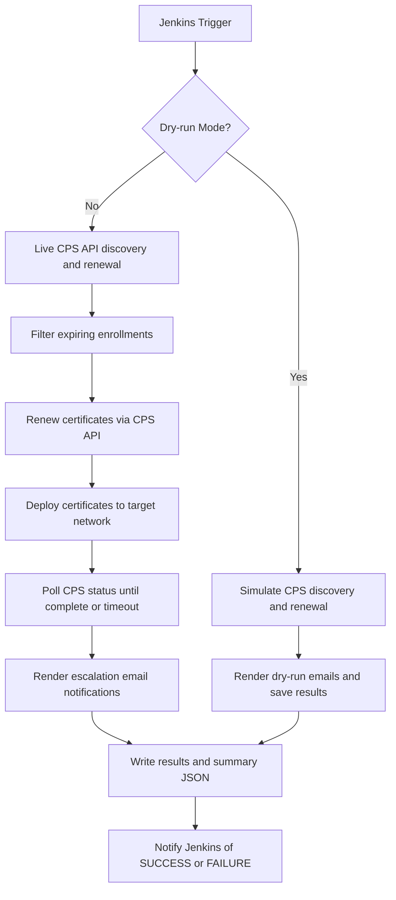
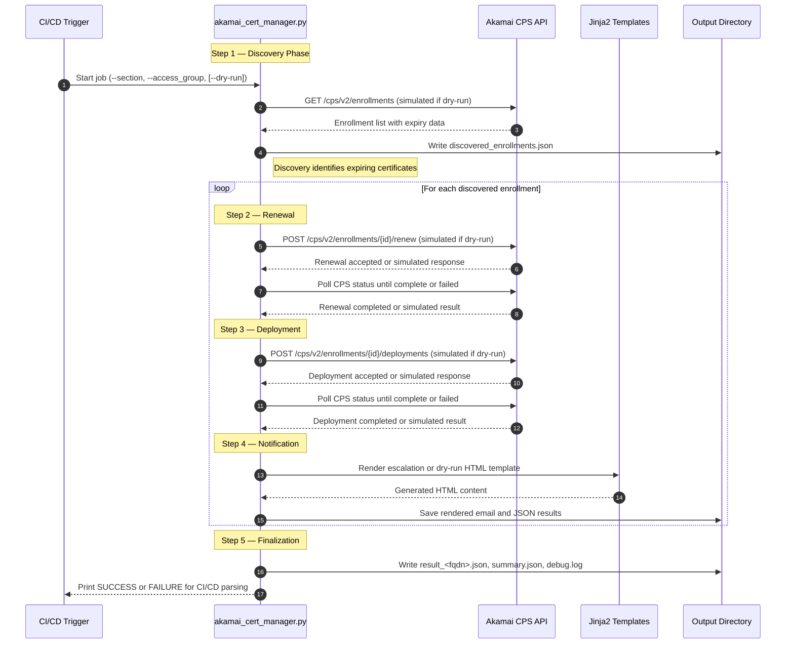

# Akamai Certificate Lifecycle Automation

## Overview

This module automates the complete certificate lifecycle for Akamai CPS (Certificate Provisioning System), including certificate renewal, deployment, polling, and notification rendering.  
It supports both **live API mode** and **dry-run simulation**, allowing safe pre-deployment validation within Jenkins pipelines or local environments.

This implementation fully replaces the previous Ansible-based automation by providing a consolidated, Python-based orchestration layer with enhanced observability, safety, and CI/CD integration.

---

## Flow Diagram

---

## Sequence Diagram

---

## Example Rendered Email (Dry-Run)

Below is an example of the email summary generated in **dry-run mode** using `certEmail_dryrun.j2`.  
It mimics the live production format but clearly displays the `DRY-RUN MODE` tag and simulated data.

  <h1>Akamai Certificate Renewal — Dry Run Summary DRY-RUN MODE</h1>
  <table>
    <tr><th>FQDN</th><td>test.example.com</td></tr>
    <tr><th>Enrollment ID</th><td>10001</td></tr>
    <tr><th>Expiry Date</th><td>27 Oct 2025</td></tr>
    <tr><th>Auto-Renewal Date</th><td>24 Oct 2025 09:00 UTC</td></tr>
    <tr><th>Deployment Network</th><td>production</td></tr>
  </table>
  
<strong>No live changes were performed.</strong>

---

## License

**Internal Use Only – HSBC / Akamai Automation Team**  
Created: October 2025  
Last Updated: October 2025
